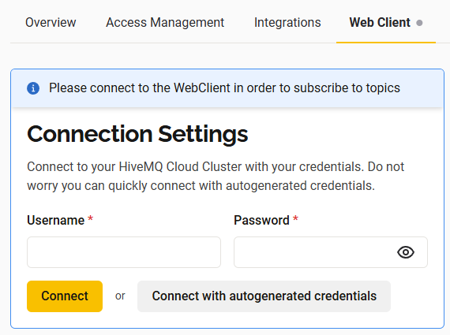
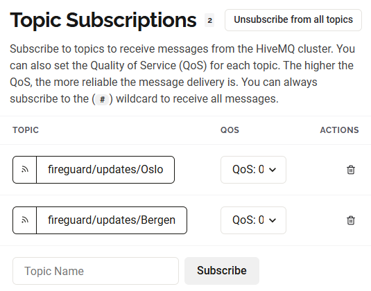
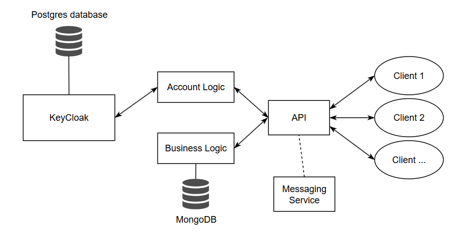
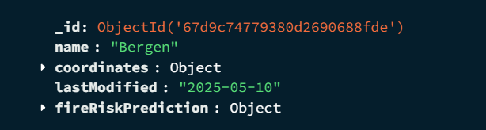
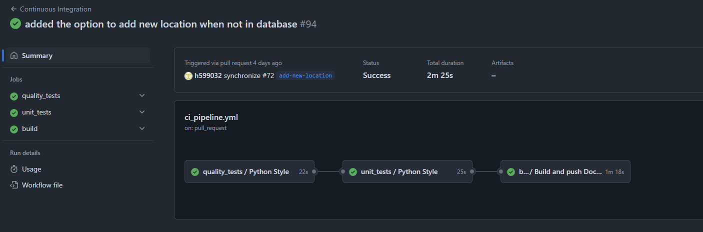

<!-- TOC start (generated with https://github.com/derlin/bitdowntoc) -->

- [Introduction](#introduction)
   * [Getting started](#getting-started)
      + [Prerequisites](#prerequisites)
      + [Getting started](#getting-started-1)
      + [Accessing the API](#accessing-the-api)
         - [Authentication](#authentication)
   * [Background](#background)
      + [Overall Architecture](#overall-architecture)
      + [Techonolgies applied](#techonolgies-applied)
      + [API/Business Logic](#api-structure)
      + [Databases](#databases)
      + [Messaging System](#messaging-system)
      + [Authentication and Authorization](#authentication-and-authorization)
      + [CI/CD and package control](#cicd-and-package-control)

<!-- TOC end -->

<!-- TOC -->
# Introduction
This repository is a project completed as part of the ADA502 - Cloud Computing course at HVL, and encompasses creating a REST API interface for getting firerisk with the [FRCM python library](https://pypi.org/project/dynamic-frcm/). 

<!-- TOC -->
## Getting started

<!-- TOC -->
### Prerequisites
This approach to running the project is based on you having access to the following technolgies in your environment: git, Docker-Desktop, DockerHub and Postman. You can use similar techonolgies as alternatives if you would like. The project has been tested against the recommended technolgies and we highly recommend them for beginners.

<!-- TOC -->
### Getting started
This project is the result of an assignment for creating a API for calculating firerisk in areas of Norway, and should be considered a result of learning and testing new techonologies.  
The project is still undergoing changes and can be considered a v0 for further development.  
To run the project in it's current state you can do the following:
1. Clone this repository
2. Edit the values in the .env file to match your setup. Take especially note of the values related to the MongoDB
3. Run all the services in the Docker compose using `docker-compose up -d`, all containers should run locally out of the box 

<!-- TOC -->
### Accessing the API
In your webrowser you can now access the public URLs exposed by the API. Since the API is built upon FastAPI one of these is localhost:8000/docs where all endpoints are detailed. Currently the following are available:
| Endpoint                             	| Authentication 	|
|--------------------------------------	|----------------	|
| localhost:8000/                      	| None           	|
| localhost:8000/public                	| None           	|
| localhost:8000/docs                  	| None           	|
| localhost:8000/api                   	| Token          	|
| localhost:8000/api/{location}        	| Token          	|
| localhost:8000/api/{location}/trends 	| Token          	|

<!-- TOC -->
#### Authentication
To access the endpoints requiring authentication you need a JWT-token aquired from Keycloak. To do this you need to send a POST-request to http://localhost:8080/realms/FireGuard/protocol/openid-connect/token. With the following parameters in the body of the HTTP-request (note also that the body has x-www-form-urlencoded):
| **Key**    	| **Content**                     	| **Test Value** 	|
|------------	|---------------------------------	|----------------	|
| client_id  	| ClientID registered in Keycloak 	| FireGuardAPI   	|
| username   	| User in keycloak database         | test           	|
| password   	| Password for user               	| testing        	|
| grant_type 	| Type of authentication          	| password       	|

*Using the provisioned test-user in Postman looks like this:*

From the POST-request will get the access-token in the response-body. To access endpoints protected by the API you can now send GET-requests to any API with this access token in the body. The figure below shows this completed for the endpoint localhost:8000/api/bergen in Postman. If everything is set up correctly you should get firerisk predictions in the response

The token does have a timeout, and you will have to get a new token each time this happens. Just repeat the earlier steps and replace your old token with the new one. 

Remember ! To access your login-priviliges you have to use localhost:8080, but when you want to access the api you have to use localhost:8000

Possible URL's that available for this api at this point in time: 
localhost:8000/
localhost:8000/public
localhost:8000/api
localhost:8000/api/{location}
localhost:8000/api/{location}/trends

### Messaging service
To run the messaging service locally you can do the following:
1. Make an account in HiveMQ and make a free cluster. 
2. In the .env file, fill in the connection values from HiveMQ under "Connection Details"
3. Make a credential in HiveMQ under "Access Management" and fill these values in the .env file. 
4. Run the Fire risk API
5. Go into terminal and run the publisher with command "python publisher.py"

You can now go into the Web Client in HiveMQ 

Fill in with the credentials made earlier or autogenerate credentials in "Connections Settings". When the client is connected you can now use the interface to subscribe to different topics. The topics are "fireguard/updates/{location_name}" and the location has to be in the database to be able to subscribe to it. When it is published to a topic the message will show in the messages window. 
Here is an example of topics:

<!-- TOC -->
## Background

<!-- TOC -->
### Overall Architecture

This project is setup as containerized services orchastrated through tools such as Docker-Compose or Kubernetes. The following services are planned:
- API connectionpoint
- KeyCloak with database for persistent storage
- Database for FireGuard data (external) 
- Messaging service

<!-- TOC -->
### Techonolgies applied
- Python -> Poetry package manager
- Docker -> Composes and images
- Keycloak
- HiveMQ Cloud
- MongoDB
- PostgreSQL
- GitHub/GitHub Actions

<!-- TOC -->
### API/Business Logic
This project provides a REST API built using FastAPI. It handles fire risk predictions, trends, and location data for geographic areas in Norway. The API is structured as follows:

**app.py**:
- Acts as the main entry point for the FastAPI application.
- Defines the following endpoints:
   - `/`: Lists all available API routes.
   - `/api/{location}`: Fetches fire risk predictions for a specific location.
   - `/api/{location}/trends`: Provides fire risk trends for a specific location.
   - `/public`: A public endpoint with general information about the API.
- Implements role-based access control using authentication mechanisms.

**Fireguard_API.py**:
   - Contains the core logic for fire risk computation and data handling.
   - Key functionalities:
      - **get_fire_risk**: Fetches fire risk predictions for a location and optionally includes weather data.
      - **get_fire_risk_trends**: Analyzes fire risk trends, including average, maximum, and minimum risk values.
      - **get_coordinates_from_StedsnavnAPI**: Retrieves geographic coordinates for a location using the StedsnavnAPI.
      - **clean_data**: Cleans and formats data by replacing invalid values.
      - **serialize_fire_risk_prediction**: Serializes fire risk prediction objects for storage and processing.

These components work together to provide a robust and scalable API for fire risk management.

<!-- TOC -->
### Databases
The project uses a single MongoDB database (FireGuardProject) with a collection named location. Each document in the collection represents a location and its associated fire risk data. As well as coordinates and last time the fire risk for the location was calculated. 

<!-- TOC -->
### Messaging System
The publisher in this project is responsible for fetching fire risk data for various locations and publishing it to a specific MQTT topics using the HiveMQ Cloud broker. 

It connects to the HiveMQ Cloud broker via secure MQTT communication over TLS and publishes fire risk updates to dynamically generated topics based on the location names (e.g., fireguard/updates/{location_name}). Location data is retrieved from the database, and the fire risk information is obtained via HTTP requests to our REST API. 

To avoid redundant computations, the REST API checks wether fire risk data has already been calculated for the current day. If so, it returns the existing data from the database. As a result, it is natural that the publisher sends updates only once per day for each location.s

<!-- TOC -->
### Authentication and Authorization

<!-- TOC -->
### CI/CD and package control
This project uses GitHub Action workflows as a main tool to complete CI and CD tasks. Our CI is formed as a streamlined pipeline completing **Quality tests -> Unit tests -> Build and Publish**, with structure to add acceptance and system tests. This CI pipeline runs every time a PR is created. The idea is to publish after the unit tests has been completed with a "dev" tag, and then publish under "latest" after acceptance and system testing has been completed. Additional notes for future development:
- We would like to implement nightly runs to complete updates to the FireRisk database and other small tasks
- We would like to re-implement GitHub environments which should complement a separation of staging and production, as well as acceptance and system testing
- We would like to improve our integration between Issues and PRs
- Add gitlinting to establish rules for how commit-messages and branches should be named

*This shows the CI pipeline as is*

Quality testing is limited to controlling the style of Python code, using the package flake8.

Unit tests are created using the inbuilt unit.test and pytest modules. This workflow simply runs these as is with the expectation that these pass. 

Building is completed for the collected FireGuardAPI Docker image, the image is published to DockerHub under: [fireguard-api](https://hub.docker.com/repository/docker/700706/fireguard-api/general)

Development of code on this project has been done using a GitHub Flow style of branching and commiting. Branches have used a style "scope/change-description", and relevant issues have been linked in the PR text
